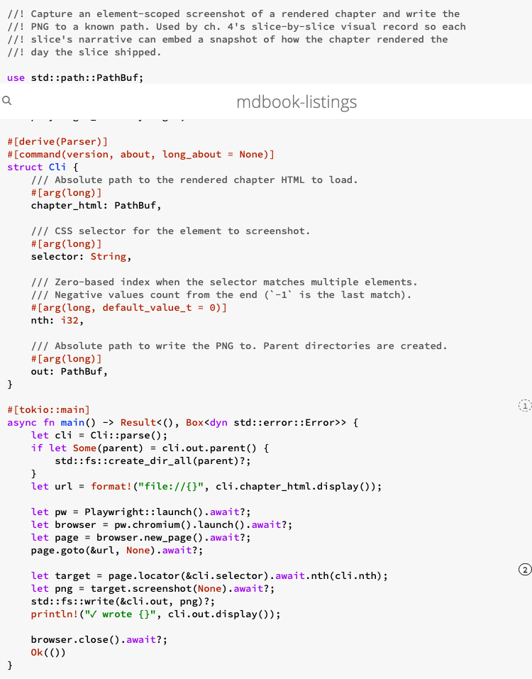

# Render Inline Callouts

```admonish note title="This chapter is in progress"
The story is being built outside-in, and the first slice is the
furthest *out* this book has reached: a real Chromium driven by
[playwright-rs](https://crates.io/crates/playwright-rs) asserts on
the rendered DOM of a callout in this very chapter. Each slice
ships as one commit; the **Outside-in narrative** sub-section
grows by one sub-section per slice.

**Note on the visual rendering of callouts.** The shape callouts
take in this rendered chapter evolves slice by slice. Slice 3
ships the simplest viable form — a `<dl class="callouts">`
appended below each code block, listing each marker's badge and
body. Later slices replace the dl with proper inline badges
positioned at the marker's line, expandable annotations, side-
margin layouts, and styled themes. What you see right now in any
demo block reflects the latest slice that has shipped at the
time of this build.
```

## Story

> As a book author, I want to attach inline annotations and named
> reference points to specific lines of a frozen listing so that my
> prose can stay keyed to the code even when the code evolves under
> a new tag.

## Acceptance criteria

Inline form (callout markers in the source itself):

1. A frozen listing whose language has a recognised inline-marker
   syntax can carry callout markers. When the chapter renders that
   listing to HTML — whether via `{{#include}}` or as the new side
   of a `{{#diff}}` (added or context lines, but not removed lines
   — a deleted marker shouldn't carry a current badge) — each
   marker produces a numbered badge at the marker's position and
   an expandable annotation reachable from the badge.
2. The same listing rendered to PDF produces a styled note for
   each callout, ordered to match the listing.
3. A callout marker may declare just a label, with no
   accompanying annotation. In that case a numbered badge appears
   at the marker's position but no expandable annotation is
   rendered. This form serves purely as a stable cross-reference
   target.

Out-of-band form (callouts attached to a listing without modifying
its bytes):

4. Callouts can be attached to a frozen listing without modifying
   the listing itself — i.e., authors can annotate code they do
   not own, or that they want to keep callout-free in the source.
5. Inline-form and out-of-band callouts compose: both sets render.
   Label collisions across the two sources fail the build.

Cross-reference and numbering:

6. Chapter prose can reference a callout by its label, and the
   reference renders as the same numbered badge, hyperlinked back
   to the listing occurrence.
7. Badge numbers are assigned ordinally within each listing and
   reset between listings. Adding or removing a callout above an
   existing one renumbers the badges visually but does not break
   label-based references.

Passthrough and robustness:

8. A frozen listing whose language has no recognised inline-
   marker syntax is rendered unchanged for inline-form parsing.
   Out-of-band callouts still apply — they don't depend on the
   listing's language.
9. A comment that resembles a callout marker but does not parse
   cleanly is left unchanged in the rendered output (no silent
   misparse).
10. A chapter reference to a callout label that does not exist
    fails the build with a diagnostic that names the missing
    label and the chapter.

Rendered shape (refining ACs 1–3 once the splicer matures past its
slice-3 placeholder dl shape):

11. The `CALLOUT:` marker comment line is **removed** from the
    rendered listing in both HTML and PDF — the surrounding code
    is shown verbatim, but the comment that carries the marker
    metadata does not appear as visible text in any rendered
    output.
12. The numbered badge is **inline** on the line that previously
    held the marker comment, in both HTML and PDF. In HTML the
    badge is interactive: hovering it reveals the body text in a
    popover, and there is no trailing `<dl>`/list element below
    the listing. In PDF the badge is non-interactive (no hover
    in print), and the bodies render in a styled note block
    after the listing (markdown blockquote per slice 6), each
    entry keyed by the same badge number that appears on the
    source line.

## The slice — outside-in narrative outline

The story ships as ten slices plus a refactor and a wrap-up
chore. Slice 1 is the outermost layer — a browser-driving
acceptance test — and the inner slices fill in the layers needed
to satisfy it.

| Slice | What it adds |
|---|---|
| 1 | playwright-rs harness. A failing `#[tokio::test] #[ignore]` in `tests/e2e_callouts.rs` launches Chromium against the rendered ch. 4 HTML and asserts a `[data-callout-badge]` element exists. The test fails (no callouts in ch. 4 yet, no parser, no HTML emitter); ignore keeps the green-build chain passing while later slices grow the rest. |
| 2 | Comment-syntax table + generic `parse_callouts` parser parameterised on prefix. Pure unit tests for every prefix in the initial table; verifies body and no-body forms; ignores malformed. |
| 3 | HTML emitter — badge at line, `<details>` nearby — wires parser into preprocessor. Handles both `{{#include}}` (the source language's comment prefix) and `{{#diff}}` (the splicer strips diff `+`/space indicators and tries every comment prefix; removed `-` lines are skipped). Slice 1's `#[ignore]` comes off and the test goes green for AC 1. `SupportedRenderer` enum extracted here. |
| 4 | Label-only inline form (AC 3). Small addition to emitter; new playwright-rs test asserting the bare-anchor case. |
| 5 | Cross-reference directive `{{#callout <label>}}` (ACs 6, 10). New playwright-rs test asserting the prose-rendered badge is hyperlinked to the listing-rendered badge anchor. |
| 6 | typst-pdf emitter — admonish-note block after the code block (AC 2). Non-browser; assertion is visual or assert_cmd-on-PDF-bytes — decided in the slice. |
| 7 | HTML rendered-shape pivot (ACs 11, 12 — HTML half). The slice-3 placeholder shape (CALLOUT comment line visible + trailing `<dl>` of bodies) is replaced with the final shape: marker comment is **stripped** from the rendered listing, and an inline interactive `<span class="callout-badge">` is overlaid on the line that previously held it. Hovering the badge reveals the body in a popover (CSS-only or `<details>`-driven). The trailing `<dl>` is removed for HTML. Cross-refs from slice 5 still resolve to the new badge anchor. New playwright-rs test asserting the comment is gone, the inline badge exists, and the body becomes visible on hover. |
| 8 | Screenshot-tool subcommands and include-block locator anchors. The preprocessor intercepts `\{{#include listings/TAG.ext}}` directives before mdbook's built-in `links` preprocessor runs and emits a `<div data-listing-tag="TAG">` anchor after the rendered fenced block — mirroring what `\{{#diff}}` already does. The capture-screenshots tool is split into two subcommands matching the two listing-rendering shapes (`include LISTING` and `diff LEFT RIGHT`). No new acceptance criterion (this is tooling, not user-visible book behavior). |
| refactor (e2e migration) | Adopt `playwright-rs-macros` `locator!()` for compile-time selector validation, then migrate every JS-string `evaluate_value` sweep in `tests/e2e_callouts.rs` to playwright-rs `Locator` + `expect(...).to_have_*()` assertions. Surfaces a slice-8 dedup bug (duplicate `id="callout-body-LABEL"` when the same label appears in two blocks) and fixes it. No new ACs; pure test-quality + small splicer hardening. |
| refactor (test infra) | Move shared e2e setup into `tests/common/e2e_harness.rs`: per-test `BrowserContext` for storage isolation, `tracing_subscriber::fmt()` so playwright-rs's `#[tracing::instrument]` spans surface under `RUST_LOG`, and per-test `BrowserContext::tracing()` recording with the trace dropped on success and saved to `target/playwright-traces/<name>.zip` on panic. The harness also dogfoods the new `playwright-rs-trace` crate by parsing the saved trace and printing failed actions to stderr inline. Sharing one `Browser` across tests via `OnceCell` was tried and reverted — `Browser` channels are bound to the `#[tokio::test]` runtime that created them, so subsequent tests deadlock; the per-test launch is the price of `#[tokio::test]` runtime isolation. Also folds in the upstream resolution of [playwright-rust#89](https://github.com/padamson/playwright-rust/issues/89): bump the `playwright-rs` git pin past `401be500` and replace the lone `history.replaceState` JS string in the click-through-navigation test with the new typed `page.clear_url_fragment().await`. The e2e suite is now JS-string-free. The migration also surfaced and fixed a long-standing badge-positioning bug exposed by the slice's 600-line v6→v7 diff: the overlay's CSS positioning formula assumed each line rendered at 1.5em, but mdbook's `<pre>` uses `line-height: normal` (~1.13 for monospace), so badges in long diffs drifted ~3px per line above their intended row, eventually landing in sibling pres above. Fix: a per-book init script (registered via `additional-js`) measures the previous pre's actual rendered height and writes a `--callout-line-px` CSS custom property the formula picks up. New regression test `every_badge_renders_inside_its_owning_pre` guards against the drift returning. |
| 9 | PDF rendered-shape pivot (ACs 11, 12 — PDF half). Marker comment is stripped from the PDF listing the same way HTML does. The inline badge is rendered as a typst superscript / inline note marker on the source line. Bodies stay in slice 6's markdown blockquote shape after the listing, each entry keyed by the same badge number. `pdf_callouts` integration test asserts both the inline marker and the blockquote bodies are present in the extracted PDF text. |
| 10 | Sidecar TOML loader + overlay logic (ACs 4, 5). New playwright-rs test asserting a sidecar-only callout renders correctly when the source has no marker. Builds on top of the slice 7/9 final rendered shape, so the sidecar tests are written against the final selectors from day one. |
| refactor | Optional. |
| wrap-up | Update `ROADMAP.md` to mark the callouts primitive shipped, materialize "What this story does not solve". |

## Outside-in narrative

### Slice 1 — playwright-rs harness + failing E2E test

The first slice introduces the outermost-layer test that the rest
of the story races to satisfy: a Rust integration test that
launches a real Chromium via
[playwright-rs](https://crates.io/crates/playwright-rs), navigates
to the rendered `ch04-render-inline-callouts.html` on disk, and
asserts that a `[data-callout-badge]` element exists with non-empty
text content. The test fails today — there's no parser, no HTML
emitter, and no callout-marked listing in this chapter yet.
`#[ignore]` keeps `cargo test` green for the green-build chain;
the author runs `cargo test --test e2e_callouts -- --ignored` once
locally to confirm the test really does fail at the badge
assertion, then commits.

`Cargo.toml` gains two `[dev-dependencies]`: `playwright-rs` (the
Rust bindings) and `tokio` (the async runtime the test uses).

{{#diff cargo-toml-v3 cargo-toml-v4}}

The new test file is `tests/e2e_callouts.rs`. The naming
parallels the other story-scoped integration test files
(`tests/install.rs`, `tests/freeze.rs`, `tests/diffs.rs`); the
`e2e_` prefix flags the harness tier so future readers don't
expect assert_cmd-style assertions from it.

```rust
{{#include listings/e2e-callouts-v1.rs}}
```

The test file is frozen as `e2e-callouts-v1` per the per-slice
freeze discipline. Slice 3 mints `e2e-callouts-v2` when it removes
the `#[ignore]`; subsequent slices that add new tests mint
further versions.

### Slice 2 — directive parser as a pure unit

Slice 2 adds the first piece slice 3's HTML emitter will need: a
parser that turns a frozen listing's source bytes into a list of
`Callout { line, label, body }`. Pure function, no IO; the
splicer in slice 3 wires it into the preprocessor.

A new `src/callout.rs` declares the `Callout` struct, the
`parse_callouts(content, comment_prefix) -> Vec<Callout>` entry
point, and a `comment_prefix_for_extension(ext) -> Option<&str>`
helper that maps file extensions to single-line comment syntaxes.
The initial table covers seventeen languages — `#` for
yaml/yml/toml/py/sh/bash/tf/hcl, `//` for
rs/c/h/cpp/hpp/js/ts/jsx/tsx, `--` for sql. Block-comment-only
languages (CSS, plain Markdown) take callouts via the sidecar
form instead and return `None` from this lookup.

```rust
{{#include listings/callout-v1.rs}}
```

The marker grammar:

```
<leading-ws><comment_prefix> CALLOUT: <label>[ <body>]
```

— exactly one space after the prefix, the literal `CALLOUT:`,
exactly one space, then a label of `[A-Za-z0-9_-]+`, then either
end-of-line or one whitespace + the rest as body. Anything that
doesn't match this exactly is silently skipped (AC 9 — no silent
misparse, the line stays in the rendered listing as-is). Fourteen
unit tests cover the happy paths for all three prefixes plus the
malformed-skip cases (wrong prefix, missing space after prefix,
missing space after `CALLOUT:`, empty label, invalid label
characters, trailing whitespace, indented marker, multiple
markers in one listing).

`src/lib.rs` gains `pub mod callout;`.

{{#diff lib-v3 lib-v4}}

The slice-1 integration test is still `#[ignore]`'d. The parser
is plumbing — slice 3 wires it into the preprocessor and emits
HTML badges, at which point the test goes green.

### Slice 3 — HTML emitter + slice-1 test goes green

Slice 3 wires `parse_callouts` into the preprocessor and emits
HTML badges. The simplest emission shape that satisfies the
slice-1 acceptance test: leave the rendered code block alone, and
append a `<dl class="callouts">` after the closing fence with one
`<dt>` per marker (carrying a numbered badge) and one `<dd>`
per marker that has a body. Per-listing ordinal numbering (AC 7)
falls out naturally — each fenced block walks its own marker list.

{{#diff callout-v1 callout-v2}}

Three things are happening in the diff above. First, the
`comment_prefix_for_language` helper normalises fence info strings
(`rust`, `python`, `c++`, `shell`) to extensions so the same
`comment_prefix_for_extension` table from slice 2 covers both
shapes. Second, the `splice_chapter` walker tracks fenced code
blocks line-by-line and dispatches per fence info: ` ```rust ` /
` ```yaml ` / etc. parse against the language's comment prefix
directly, while ` ```diff ` strips the `+` or space indicator
from each line and tries every known comment prefix (so a diff
of any source language carries its callouts through to the
rendered HTML). Removed `-` lines and diff metadata (`---`,
`+++`, `@@`, `\`) are skipped — a deleted callout shouldn't
carry a current badge. Third, three `CALLOUT:` markers were
added to the source as a dogfood demonstration; the `<dl>` you
see right above is the splicer's output for the diff path on
those three markers.

Snapshot (slice 3) of the diff path's dl as it looked the day
slice 3 shipped:


To exercise the splicer's `{{#include}}` path on a different
input shape, here is the source of the screenshot tool — a small
`playwright-rs` script with one CALLOUT marker:

```rust
{{#include listings/capture-screenshots-v1.rs}}
```

The `<dl>` directly below this listing is what the splicer
emitted for the marker on the `target` line above — one entry,
showing the marker doing real work in this very chapter.

Snapshot (slice 3) of the include path's dl:


Both images are frozen-in-time snapshots. Readers viewing this
chapter on a build *after* a later slice will see the live
rendered shape above each image differ from the snapshot — slice
4 onward replaces the dl form with proper inline badges, side-
margin annotations, and styled themes. The images stay as the
record of what slice 3 produced.

The screenshot tool above is itself a workspace member at
`tools/capture-screenshots/` — kept in the repo for slice 4
onward to reuse, but excluded from the published `mdbook-listings`
crate (own `Cargo.toml` with `publish = false`). Run with
`cargo run -p capture-screenshots -- --chapter-html …
--selector dl.callouts --nth N --out …` to snapshot a particular
match in a particular chapter.

`src/main.rs`'s `preprocess` now chains the diff splicer's output
into `callout::splice_chapter`, so `{{#diff}}` resolution and
callout rendering both apply to every chapter.

{{#diff main-v5 main-v6}}

`tests/e2e_callouts.rs` drops its `#[ignore]`. The Playwright
test now runs against the just-built ch. 4 HTML, finds the
`[data-callout-badge]` elements emitted by the splicer above,
and goes green — closing AC 1 end-to-end.

{{#diff e2e-callouts-v1 e2e-callouts-v2}}

### Slice 4 — label-only inline form

Slice 4 closes AC 3: a callout marker may declare just a label
with no accompanying body, in which case a numbered badge appears
but no annotation. As it turns out, the slice-3 emitter already
handles this — when `body.is_none()` the emitter skips the `<dd>`,
so a label-only marker renders as a `<dt>` with badge and no
following `<dd>`. Slice 4's job is therefore a small one: add a
label-only marker somewhere ch. 4 includes, and add a Playwright
test that pins the visual contract so future slices can't
regress it.

The new marker is on the `cli` parse line in the screenshot
tool's source — a label-only callout, ready for slice 5's
`{{#callout cli-parse}}` directive to point at:

{{#diff capture-screenshots-v1 capture-screenshots-v2}}

Snapshot (slice 4) of the dl that the splicer now emits below the
screenshot tool's rendered source — two entries this slice
(`locator-pick` from slice 3 with a body, plus `cli-parse` added
just now as a bare anchor):


A new e2e test queries the post-render DOM for the
`callout-cli-parse` `<dt>` and asserts its `nextElementSibling`
is **not** a `<dd>` — i.e., the label-only form really does
produce a bare badge:

{{#diff e2e-callouts-v2 e2e-callouts-v3}}

Same caveat as slice 3's snapshot: if you're reading this on a
build after a later slice, the live render above will show
whatever shape that slice produced; the image stays as the slice-4
record.

### Slice 5 — cross-reference directive `{{#callout <label>}}`

Slice 5 closes ACs 6 and 10: chapter prose can reference a callout
by label and the reference renders as the same numbered badge,
hyperlinked back to the listing-side `<dt id="callout-<label>">`
anchor; a reference to a label that no marker in the chapter
defines fails the build with a diagnostic that names the missing
label.

The splicer in `src/callout.rs` becomes two-pass. The first pass
walks every fenced block in the chapter and collects a
`label → ordinal` map (the ordinal is the badge number that label
got at its first occurrence). The second pass scans chapter prose
— i.e. the bytes outside any fenced block — for
`{{#callout <label>}}` directives and replaces each with an inline
anchor. A reference to a label that's not in the map raises
`SpliceError::UnknownLabel` and the preprocessor exits non-zero.

The diff itself adds two new CALLOUT markers on slice 5's own new
functions (`replace_callout_refs` and `render_callout_ref`), so
the dl that the splicer renders below the diff has fresh anchors
that this slice's prose then points back at:

{{#diff callout-v2 callout-v3}}

Snapshot (slice 5) of the dl rendered below the diff above. The
v2→v3 diff's context window picks up `splice-entry` (carried over
from slice 3 — the new code was added near it) and the two
brand-new markers from this slice, `cross-ref-replace` and
`cross-ref-emit`:


`src/main.rs`'s `preprocess` chain propagates the new
`SpliceError` out of `splice_callouts`, so the build stops at the
chapter that contains the offending reference instead of silently
emitting a broken anchor:

{{#diff main-v6 main-v7}}

The new e2e test queries the prose-side anchor by its
`data-callout-ref` attribute, asserts its `href` matches the
listing-side dt id, and confirms the target dt actually exists in
the rendered DOM:

{{#diff e2e-callouts-v3 e2e-callouts-v4}}

To dogfood the directive in this very chapter: the next sentence's
badge is a `{{#callout cross-ref-emit}}` directive that this
slice's splicer resolves to point at the `cross-ref-emit` marker
introduced by the callout-v2→v3 diff above. Clicking it should
jump the page to that marker's dt anchor.

See callout {{#callout cross-ref-emit}} for the rendering helper
this reference resolves to.

Snapshot (slice 5) of the live cross-reference badge embedded in
the prose paragraph above:


Same caveat as the earlier slices' snapshots: the image freezes
slice 5's rendered shape, while the live badge above will track
later slices' styling changes.

### Slice 6 — typst-pdf emitter

Slice 6 closes AC 2: the same listing rendered to PDF produces a
styled note for each callout, ordered to match the listing. Until
this slice the splicer always emitted raw HTML (`<dl class="callouts">`,
`<a class="callout-ref">`); typst-pdf has no `<dl>`/`<a>` support
in its markdown→typst conversion, so PDF builds rendered the
callouts as escaped raw HTML instead of styled note blocks. Slice
6 makes the splicer renderer-aware: HTML stays unchanged, but for
the typst-pdf renderer the same parser output is emitted as a
markdown blockquote — bold ordinal + label, optional em-dash
plus body — which typst-pdf converts to a quoted note block in
the PDF.

A new `SupportedRenderer` enum (Html / TypstPdf) is the dispatch
key. The preprocessor reads `ctx.renderer` from the JSON envelope
mdbook hands it, looks up the variant once at the top of
`preprocess()`, and threads it through `splice_callouts` to the
two leaf emitters (`render_callout_list` and `render_callout_ref`).
Inputs that name an unrecognised renderer (e.g. a third-party
backend that mdbook-listings hasn't been taught about) cause the
preprocessor to error rather than silently fall back to one of
the known emitters — matching what `supports()` already advertises.

The slice-6 production-code change in `src/callout.rs` is shown
as a curated snippet rather than the full v3→v4 diff. The full
diff includes new unit-test fixtures whose embedded triple-backtick
strings overload the typst-pdf markdown→typst converter; the
snippet captures the new enum, the renderer-aware dispatcher, and
the new PDF emitter — together they're the entire user-visible
production-code change in this slice:

```rust
{{#include snippets/callout-pdf-emit-snippet-v1.rs}}
```

The file lives under `book/src/snippets/` rather than
`book/src/listings/` because it is a hand-curated excerpt rather
than a frozen tag — the `mdbook-listings freeze` discipline only
applies to byte-exact mirrors of an upstream source file. Snippets
are versioned by convention (`-v1`, `-v2`, …) so a later slice
that needs to extend the curated excerpt mints a new file rather
than mutating an earlier slice's frozen-in-time reference.

The snippet itself dogfoods a CALLOUT marker on the new
`render_callout_list_pdf` function (`pdf-emit`), so the splicer
emits a `<dl class="callouts">` directly below the snippet above.
Snapshot (slice 6) of that HTML dl as it looked the day slice 6
shipped:


`src/main.rs`'s `preprocess` resolves the renderer once and passes
it through:

{{#diff main-v7 main-v8}}

A new dev-dep, [`pdf-extract`](https://crates.io/crates/pdf-extract)
(pure-Rust, no system deps), drives the PDF integration test —
robust to typst version bumps because it asserts on body-text
substrings rather than byte-exact PDF structure. The test is
gated to the Linux CI job that has the typst fonts installed and
the just-built PDF available; the cross-platform `Test on …` jobs
exclude both `e2e_callouts` and `pdf_callouts` since they need a
built book.

`Cargo.toml` gains the single `pdf-extract` `[dev-dependencies]`
entry — kept narrow because the test only needs the crate's
`extract_text_from_mem` function:

{{#diff cargo-toml-v4 cargo-toml-v5}}

The new test file is `tests/pdf_callouts.rs`, mirroring the
naming convention of the other story-scoped integration test
files (`tests/e2e_callouts.rs`, `tests/diffs.rs`). It reads the
just-built PDF off disk, runs it through `pdf-extract`, and
asserts that two known callout body fragments — `splice-entry`'s
"HTML splicer entry point" and `cross-ref-emit`'s "Renders the
prose-side anchor" — appear in the extracted text:

```rust
{{#include listings/pdf-callouts-v1.rs}}
```

Snapshot (slice 6) of one PDF page that renders the slice 5
callout-v2→v3 diff. The dl that the HTML emitter produces below
the diff appears here as a quoted note block — three entries,
bold ordinal + label, em-dash + body — directly under the diff
fence:


The visual on this page is a frozen snapshot of slice 6's PDF
output; the page number itself shifts as the book grows. CI runs
`cargo test --test pdf_callouts` against the just-built PDF on
every push, so any regression in the PDF emitter surfaces as a
failed assertion rather than a quietly-broken render.

### Slice 7 — HTML rendered-shape pivot

Slice 7 closes the HTML half of ACs 11 and 12. The slice-3
placeholder shape (CALLOUT comment line visible in the listing
plus a trailing `<dl class="callouts">` of bodies) is replaced
with the final shape:

- The marker comment is **stripped** from the rendered listing
  for `{{#include}}` blocks (every recognised language with an
  inline-marker syntax). Diff blocks pass through unchanged so
  the diff format stays valid; the canonical badge anchor lives
  on the include, not on the diff history.
- The trailing `<dl>` is gone. In its place an absolutely-
  positioned `<div class="callout-overlay">` sibling holds one
  interactive `<button class="callout-badge">` per marker, each
  carrying the post-strip `data-callout-line` so CSS positions it
  on the line that previously held the marker comment.
- The vertical positioning is completely JavaScript-free. The Rust
  HTML emitter calculates the total lines in the code block and
  injects `--callout-listing-lines` directly into the DOM, which
  the bundled CSS uses to perfectly align the badge to the line.
- Hovering or keyboard-focusing the badge reveals its body in a
  popover (a sibling `<div class="callout-body">`). The entrance
  and exit animations are choreographed purely in CSS using
  `clip-path`, `color`, and `visibility` transitions (eliminating
  the need for abrupt `[hidden]` attribute toggles). Label-only
  markers emit no popover at all — just the badge.

Slice 7 mints a new version of the slice-6 snippet,
`callout-pdf-emit-snippet-v2`, that extends the curated excerpt
with the two cross-ref-related functions (`replace_callout_refs`
and `render_callout_ref`) so the callout markers attached to them
(`cross-ref-replace`, `cross-ref-emit`) now have rendered
`<button>` anchors. Slice 5's `{{#callout cross-ref-emit}}`
cross-reference resolves to that anchor:

```rust
{{#include snippets/callout-pdf-emit-snippet-v2.rs}}
```

Snippets are versioned by convention because slice 6's narrative
references v1 and that text shouldn't silently drift when later
slices extend the excerpt; minting a new file preserves the
slice-6 reference verbatim.

To dogfood the label-only form (`cli-parse`) under the new shape,
the slice-4 frozen `capture-screenshots-v2.rs` is included here
as well. The `// CALLOUT: cli-parse` line is stripped from the
rendered listing; in its place the splicer's overlay div holds a
bare badge button on the `Cli::parse()` line:
```rust
{{#include listings/capture-screenshots-v2.rs}}
```

`src/callout.rs` gains the new `splice_callout_lists_html`
emitter that walks each fenced block, calls `strip_marker_lines`
to rewrite the body without marker comments, and appends
`render_callout_overlay_html` after the closing fence. The PDF
emitter (`splice_callout_lists_pdf`) is unchanged from slice 6 —
slice 9 is the PDF-side rendered-shape pivot.

The bundled CSS asset (`assets/mdbook-listings.css`) gains the
positioning + hover rules for the new shape. The `install`
command writes this file into the book's theme directory just
like before; users who already installed mdbook-listings need
to rerun `mdbook-listings install` to pick up the slice-7 CSS.

Snapshot (slice 7) of the rendered HTML for the screenshot tool
include — the marker comment is gone and the badge sits at the
right margin of its line:



The dl is gone; the badges are interactive; the body popover
shows on hover. Visual reference is from the day slice 7 shipped
— later slices may restyle.

The screenshot above was produced by the workspace tool
`tools/capture-screenshots/`, which slice 7 also evolved: it now
takes a positional listing tag (`capture-screenshots
e2e-callouts-v5`) and finds the listing in the rendered HTML via the
`<div data-listing-tag>` anchor that the diff splicer just learned to
emit, with a callout-badge fallback for `{{#include}}` blocks whose
source has at least one `CALLOUT:` marker. That fallback has a blind
spot — listings without callouts and not on the right side of any
diff aren't addressable. Slice 8 closes that gap by re-engineering
the tool into two subcommands (`include LISTING` and
`diff LEFT RIGHT`) backed by a preprocessor pass that injects the
same kind of locator anchor after every `\{{#include listings/...}}`
block.

### Slice 8 — screenshot-tool subcommands and include-block locator anchors

Slice 8 doesn't satisfy any chapter AC (those are 1–12 from the
section above); it's tooling that closes a usability gap exposed by
slice 7 dogfooding. With slice 7 the screenshot tool can address
listings shown via `\{{#diff}}` (locator: the `<div data-listing-tag>`
anchor the diff splicer learned to emit) and listings shown via
`\{{#include}}` *that have at least one `CALLOUT:` marker* (fallback
locator: the `button[id="callout-LABEL"]` element from the rendered
overlay). Listings without callouts and not referenced by any diff
were unreachable.

The fix has two parts: a preprocessor side (a new include splicer +
a richer diff anchor) and a tool side (subcommands matching the two
listing-rendering shapes).

**Preprocessor — new `src/include.rs` module.** Intercepts
`\{{#include listings/TAG.ext}}` directives BEFORE mdbook's built-in
`links` preprocessor would expand them, replaces each with the
file's bytes, and emits a `<div data-listing-tag="TAG">` anchor
after the enclosing fenced block's closing fence line. To run
before `links`, the `book/book.toml` listings-preprocessor entry
adds `before = ["admonish", "links"]` — without that ordering,
`links` expands every `\{{#include}}` first and the include splicer
silently no-ops. The splicer's path-prefix dispatch is at callout
{{#callout snippets-intercept}}; the entry point that drives the
whole replace-and-emit walk is at callout {{#callout
include-splice-entry}}; the line that drops the locator anchor is
at callout {{#callout include-anchor-emit}}:

```rust
{{#include listings/include-v1.rs}}
```

`\{{#include snippets/...}}` paths are also intercepted (callout
{{#callout snippets-intercept}}) — *without* an anchor — so the
callout splicer downstream sees their `CALLOUT:` markers (otherwise
mdbook's `links` would expand them after our callout pass and the
markers would land in the rendered HTML with no overlay buttons).
All other includes (`../some/path`, line-range syntax `:N:M`,
anchor refs `:setup`) pass through untouched for `links` to handle.

The diff splicer's anchor also expands from the slice-7
single-attribute `data-listing-tag="RIGHT"` to the dual-attribute
`data-listing-diff-left="LEFT" data-listing-diff-right="RIGHT"`
(callout {{#callout diff-anchor-dual}}), so the locator is unique
even when several diffs share a right operand. Slice 8 also evolves
the HTML splicer to process diff blocks for callouts: `+`-prefixed
and ` `-prefixed marker lines are stripped and emit a badge keyed
to the line that previously held them; `-`-prefixed marker lines
are dropped silently with no badge — the callout is gone in the
new state, so neither the comment nor a marker for it appears in
the rendered diff:

{{#diff diff-v7 diff-v8}}

The preprocessor wires the new include splicer into `preprocess()`
as the first stage of a three-stage chain — includes → diffs →
callouts (callout {{#callout preprocessor-chain}}). Order matters:
the callout splicer needs included source bytes inline so it can
parse `CALLOUT:` markers from them.

{{#diff main-v8 main-v9}}

Five integration tests in `tests/includes.rs` exercise the new
splicer end-to-end through the JSON envelope: directive replacement,
anchor emission position, snippet expansion without anchor, both
include and diff anchors emitted from one chapter, and the
missing-file error path:

```rust
{{#include listings/includes-tests-v1.rs}}
```

**Tool — subcommand redesign.** `tools/capture-screenshots/` becomes
a clap `Subcommand` with `include LISTING` and `diff LEFT RIGHT`
arms. Each subcommand discovers the chapter by scanning chapter
`.md` files for the directive substring (`\{{#include
listings/LISTING.` or `\{{#diff LEFT RIGHT`), navigates Chromium to
the chapter HTML via
[playwright-rs](https://crates.io/crates/playwright-rs), and
locates the rendered `<pre>` via a single CSS selector
(`[data-listing-tag="LISTING"]` or
`[data-listing-diff-left="LEFT"][data-listing-diff-right="RIGHT"]`).
The slice-7 callout-badge fallback is gone — anchors cover both
shapes now. Default output paths are
`book/src/images/<LISTING>.png` and
`book/src/images/<LEFT>__to__<RIGHT>.png`. The subcommand is
dispatched at callout {{#callout subcommand-dispatch}}:

{{#diff capture-screenshots-v2 capture-screenshots-v3}}

The tool also dogfoods the unreleased v0.13.0 work in the
[`padamson/playwright-rust`](https://github.com/padamson/playwright-rust)
repo: the workspace `Cargo.toml`'s `[workspace.dependencies]` table
now sources `playwright-rs` as a git dep on `branch = "main"`, and
the tool wires up `tracing_subscriber` so playwright-rs's new
`#[tracing::instrument]` spans (every `goto`, `evaluate_value`,
`screenshot`, `browser.close`) log automatically once the upstream
instrumentation merges. Local debugging gets richer for free with
no per-callsite logging.

{{#diff cargo-toml-v5 cargo-toml-v6}}

### Refactor (e2e migration) — `locator!()` macro and the assertion API

This refactor doesn't satisfy any chapter AC; it's pure test-quality
work that takes advantage of two playwright-rs surfaces that landed
on the upstream `padamson/playwright-rust` `main` branch and that
slice 8 sourced via the workspace git dep:

- The **`playwright-rs-macros` crate** ships a `locator!(...)`
  proc-macro that compile-time-validates Playwright selector strings
  for empty input, unbalanced brackets, and unknown engine prefixes.
  Adopted at every direct `page.locator(...)` call site (3 sites
  total — most of our locator usage lives inside JS strings fed to
  `evaluate_value`, which the proc-macro can't reach). Verified by
  deliberately introducing an unbalanced `[data-callout-badge`
  selector and observing `error: unclosed `[`` at compile time.
- The **`expect(locator).to_have_*()` assertion API** (added across
  the v0.12.x line) auto-retries on flake, returns precise failure
  messages with line numbers, and reads more like the test's intent
  than the equivalent JS-blob `evaluate_value` returning a CSV.

Migrating `tests/e2e_callouts.rs` from the slice-7/8-era JS-blob
sweeps to locator + assertion calls is a substantial rewrite — every
DOM query, every attribute check, every visibility assertion. Only
one JS line remains (a `history.replaceState(...)` mutation in the
click-through test, since that's a history-API operation with no
playwright equivalent).

The full diff against `tests/e2e_callouts.rs` (v5 → v6) shows
every JS-blob `evaluate_value` call replaced with a typed
`page.locator(...).await` plus an `expect(...).to_have_*()`
assertion (or a `Locator::nth(i)` iteration when the test sweeps
multiple matches):

{{#diff e2e-callouts-v5 e2e-callouts-v6}}

The migration surfaced a real slice-8 splicer bug. playwright-rs's
strict-mode locator refused to resolve `#callout-body-cross-ref-emit`
because the rendered chapter contained TWO `<div>` elements with
that id — one from the snippet `{{#include}}` of
`callout-pdf-emit-snippet-v2.rs`, one from the diff `+`-line marker
addition slice 8 wired badge emission for. The button id was
already dedup'd via the existing `emitted_anchor: HashSet<String>`,
but the body div's id was not. Fix in `src/callout.rs`: lockstep
dedup of the body div's `id` and the button's `aria-describedby`
against the same `is_first_occurrence` boolean — callout
{{#callout body-id-dedup}}. The diff against `src/callout.rs`
(v5 → v6) shows the splicer change:

{{#diff callout-v5 callout-v6}}

The fix is small but the lesson is bigger: the JS-blob sweeps
silently ignored the duplicate-id violation because `document.
getElementById` returns the first match. The locator-API migration
made the bug observable.

### Refactor (test infra) — shared e2e harness, tracing, and trace-on-failure

Continues the playwright-rs adoption from the previous refactor by
moving the per-test browser setup into a shared
`tests/common/e2e_harness.rs` and dogfooding two more upstream
surfaces:

- **`tracing_subscriber` integration.** The harness initialises
  `tracing_subscriber::fmt().with_test_writer()` once per test
  process, scoped through `EnvFilter` (defaults to `info`,
  `RUST_LOG` overrides). playwright-rs's `#[tracing::instrument]`
  spans on every `goto`, `evaluate_value`, `screenshot`,
  `browser.close`, etc. now surface in test output on demand —
  drop in `RUST_LOG=playwright_rs=info cargo test --test
  e2e_callouts -- --nocapture` to watch the protocol play out.
- **`playwright-rs-trace` recording on failure.** Each test wraps
  its body in `BrowserContext::tracing().start(...)` and stops with
  a save path only on panic. Failing tests leave
  `target/playwright-traces/<test>.zip` — drag into
  https://trace.playwright.dev or `npx playwright show-trace` for
  step-through inspection. The harness also runs the saved trace
  through `playwright_rs_trace::open()` and prints any
  errored-action summary inline so quick triage doesn't require
  leaving the terminal.
- **Per-test `BrowserContext`** for storage isolation between
  tests. `file://` URLs don't really need it today but the pattern
  is correct.

The harness wraps each test body in
`std::panic::AssertUnwindSafe(...).catch_unwind()` (via the
`futures` crate) so a panic in the test body still flows through
trace cleanup before re-raising.

The diff against `tests/e2e_callouts.rs` (v6 → v7) shows every
test body collapsing into a `with_traced_chapter("test-name",
CH04, |page| async move { ... }).await` call — the per-test
`Playwright::launch`, `pw.chromium().launch()`, `browser.new_page()`,
and `browser.close()` move into the harness, and the test body
inherits a `Page` already navigated to the chapter HTML.

{{#diff e2e-callouts-v6 e2e-callouts-v7}}

Three strategically placed callout markers anchor the long diff
above: the harness import (callout {{#callout harness-import}}), the
canonical call shape every test now follows
(callout {{#callout harness-call}}), and the line that drops the
last JS string in the suite (callout {{#callout clear-url-fragment}}).

The harness landed without the originally-planned shared `Browser`
optimisation. Each `#[tokio::test]` creates its own tokio runtime;
a `Browser` handle's internal channels are bound to the runtime
that created them. Sharing a `Browser` via `tokio::sync::OnceCell`
across tests deadlocks once the first test's runtime exits —
subsequent tests block forever waiting for responses on dead
channels. Per-test `Playwright::launch + browser.launch` is the
price of `#[tokio::test]` runtime isolation.

The dogfooding cycle filed this as
[playwright-rust#90](https://github.com/padamson/playwright-rust/issues/90)
and the upstream response landed within the same pass: a
debug-build assertion that captures the launching runtime's ID at
`Connection` construction and panics in `Connection::send_message`
when the current runtime differs. Silent deadlock is now a loud
panic with a clear message. The mdbook-listings harness also
gained verbose chatter at `playwright_rs=debug` from the same
upstream — each protocol message dispatched dumped tens of KB per
test. Filed as
[playwright-rust#91](https://github.com/padamson/playwright-rust/issues/91);
upstream demoted the per-message log lines from `debug` to `trace`,
making `RUST_LOG=playwright_rs=debug` usable for triage again.

This refactor also folds in the upstream resolution of
[playwright-rust#89](https://github.com/padamson/playwright-rust/issues/89).
The previous refactor's locator/assertion migration left exactly
one JS string in the suite — a `history.replaceState(null, '',
location.pathname)` mutation in the click-through-navigation test,
since playwright-rs had no typed equivalent. Filed
[#89](https://github.com/padamson/playwright-rust/issues/89)
upstream; resolved within the dogfooding pass as commit
[`401be500`](https://github.com/padamson/playwright-rust/commit/401be50)
which adds `Page::clear_url_fragment()`. Bumping the workspace
`playwright-rs` git pin past that commit and replacing the JS
line with `page.clear_url_fragment().await` (visible in the
v6 → v7 diff above) makes the e2e suite JS-string-free.

The migration also surfaced a long-standing positioning bug. The
v6 → v7 diff above is ~600 lines tall — its first two callouts
(`harness-import` at line 9, `harness-call` at line 35) sit near
the top, the third (`clear-url-fragment` at line 529) near the
bottom. In the browser, only the third one rendered where it
should; the other two visually appeared inside the *previous*
diff (the `callout-v5 → callout-v6` block in the previous
refactor section). The cross-references still navigated to the
right anchors — the IDs were correct — but the badges themselves
had drifted ~1800px above their intended rows.

Root cause: the overlay's CSS positioning formula assumed each
listing line rendered at 1.5em (in the overlay's 0.875em font =
21px). mdbook's `<pre>` actually uses `line-height: normal`,
which Chromium computes as ~1.13 for monospace = ~18px. A 3px
per-line gap × 600 lines compounds to ~1800px of cumulative
drift — enough to push the line-9 and line-35 badges entirely
out of the v6 → v7 diff and into the previous sibling pre.

Fix: ship a tiny per-book init script (registered via
`additional-js` in `book.toml`, alongside the existing
`additional-css` entry) that walks every `.callout-overlay` on
page load, measures the previous `<pre>`'s actual rendered height,
divides by the listing's line count, and writes the per-line pixel
value as a CSS custom property `--callout-line-px` on the overlay.
The CSS formula then uses `var(--callout-line-px, 1.5em)` instead
of the bare `1.5em`, so the bug doesn't reappear no matter what
font or theme an author drops in. A new e2e regression test —
`every_badge_renders_inside_its_owning_pre` — asserts that every
badge's bounding box lies within its sibling pre's, so this can't
silently regress. The diff against `tests/e2e_callouts.rs` (v7 →
v8) shows the new test:

{{#diff e2e-callouts-v7 e2e-callouts-v8}}

<!--
Scaffolding for later slices — sidecar TOML format sketch,
retrospective application to earlier chapters, and the "What this
story does not solve" section. Materialized in the wrap-up chore
once the story has shipped.

Sidecar format sketch (subject to change):

    # book/src/listings/manifest-v1.callouts.toml
    [[callout]]
    line = 47
    label = "upsert-order"
    body = "Preserves insertion order on replacement."

    [[callout]]
    line = 62
    label = "empty-manifest"
    # no body field → bare anchor

Retrospective application to earlier chapters:

After this story ships, a chore-level follow-up walks back through
the listings already frozen by ch. 1 (Install), ch. 2 (Freeze),
and ch. 3 (Show Diffs) and adds callouts to them — preferentially
via sidecar files, since the source code itself doesn't need to
change. The point is to demonstrate, in place, how callouts
replace the conventional inline-comment style of code
documentation: the prose lives in the chapter, the labels make
the prose addressable from the source position, and the source
stays comment-light. This is not a new user story; it's an
application of the now-available primitive to the book's own
back-catalogue.
-->
