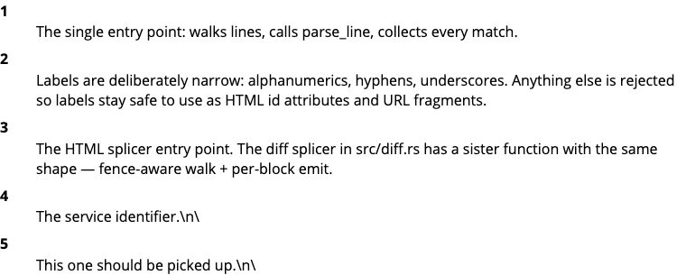
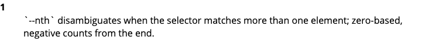
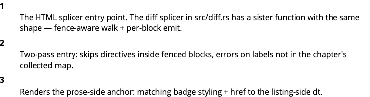
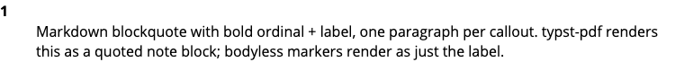
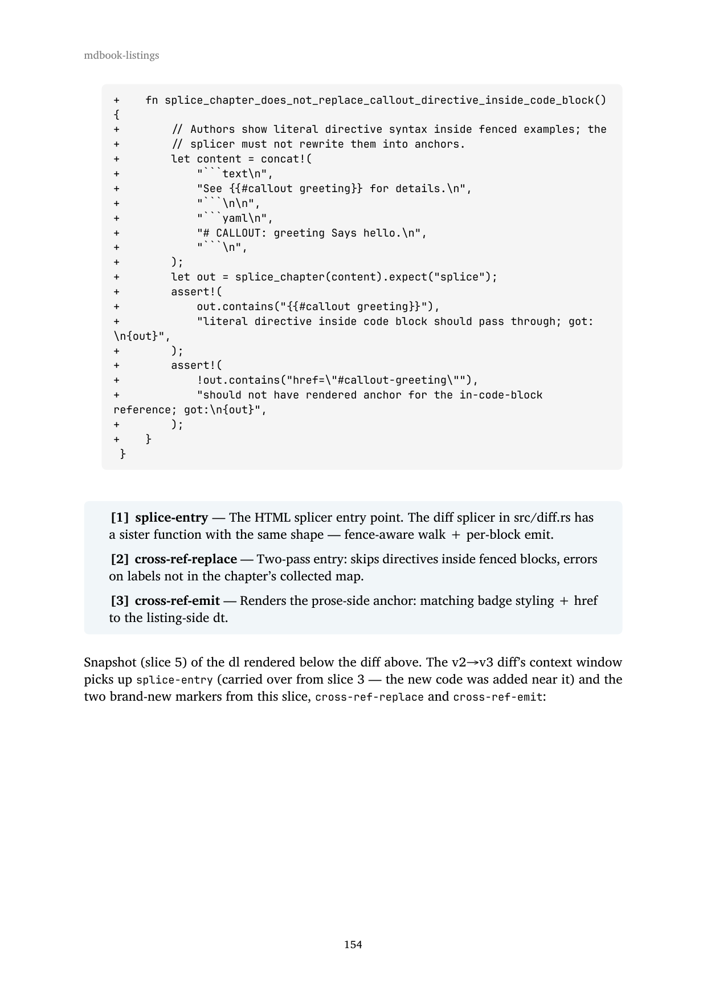

# Render Inline Callouts

```admonish note title="This chapter is in progress"
The story is being built outside-in, and the first slice is the
furthest *out* this book has reached: a real Chromium driven by
[playwright-rs](https://crates.io/crates/playwright-rs) asserts on
the rendered DOM of a callout in this very chapter. Each slice
ships as one commit; the **Outside-in narrative** sub-section
grows by one sub-section per slice.

**Note on the visual rendering of callouts.** The shape callouts
take in this rendered chapter evolves slice by slice. Slice 3
ships the simplest viable form — a `<dl class="callouts">`
appended below each code block, listing each marker's badge and
body. Later slices replace the dl with proper inline badges
positioned at the marker's line, expandable annotations, side-
margin layouts, and styled themes. What you see right now in any
demo block reflects the latest slice that has shipped at the
time of this build.
```

## Story

> As a book author, I want to attach inline annotations and named
> reference points to specific lines of a frozen listing so that my
> prose can stay keyed to the code even when the code evolves under
> a new tag.

## Acceptance criteria

Inline form (callout markers in the source itself):

1. A frozen listing whose language has a recognised inline-marker
   syntax can carry callout markers. When the chapter renders that
   listing to HTML — whether via `{{#include}}` or as the new side
   of a `{{#diff}}` (added or context lines, but not removed lines
   — a deleted marker shouldn't carry a current badge) — each
   marker produces a numbered badge at the marker's position and
   an expandable annotation reachable from the badge.
2. The same listing rendered to PDF produces a styled note for
   each callout, ordered to match the listing.
3. A callout marker may declare just a label, with no
   accompanying annotation. In that case a numbered badge appears
   at the marker's position but no expandable annotation is
   rendered. This form serves purely as a stable cross-reference
   target.

Out-of-band form (callouts attached to a listing without modifying
its bytes):

4. Callouts can be attached to a frozen listing without modifying
   the listing itself — i.e., authors can annotate code they do
   not own, or that they want to keep callout-free in the source.
5. Inline-form and out-of-band callouts compose: both sets render.
   Label collisions across the two sources fail the build.

Cross-reference and numbering:

6. Chapter prose can reference a callout by its label, and the
   reference renders as the same numbered badge, hyperlinked back
   to the listing occurrence.
7. Badge numbers are assigned ordinally within each listing and
   reset between listings. Adding or removing a callout above an
   existing one renumbers the badges visually but does not break
   label-based references.

Passthrough and robustness:

8. A frozen listing whose language has no recognised inline-
   marker syntax is rendered unchanged for inline-form parsing.
   Out-of-band callouts still apply — they don't depend on the
   listing's language.
9. A comment that resembles a callout marker but does not parse
   cleanly is left unchanged in the rendered output (no silent
   misparse).
10. A chapter reference to a callout label that does not exist
    fails the build with a diagnostic that names the missing
    label and the chapter.

## The slice — outside-in narrative outline

The story ships as seven slices plus a refactor and a wrap-up
chore. Slice 1 is the outermost layer — a browser-driving
acceptance test — and the inner slices fill in the layers needed
to satisfy it.

| Slice | What it adds |
|---|---|
| 1 | playwright-rs harness. A failing `#[tokio::test] #[ignore]` in `tests/e2e_callouts.rs` launches Chromium against the rendered ch. 4 HTML and asserts a `[data-callout-badge]` element exists. The test fails (no callouts in ch. 4 yet, no parser, no HTML emitter); ignore keeps the green-build chain passing while later slices grow the rest. |
| 2 | Comment-syntax table + generic `parse_callouts` parser parameterised on prefix. Pure unit tests for every prefix in the initial table; verifies body and no-body forms; ignores malformed. |
| 3 | HTML emitter — badge at line, `<details>` nearby — wires parser into preprocessor. Handles both `{{#include}}` (the source language's comment prefix) and `{{#diff}}` (the splicer strips diff `+`/space indicators and tries every comment prefix; removed `-` lines are skipped). Slice 1's `#[ignore]` comes off and the test goes green for AC 1. `SupportedRenderer` enum extracted here. |
| 4 | Label-only inline form (AC 3). Small addition to emitter; new playwright-rs test asserting the bare-anchor case. |
| 5 | Cross-reference directive `{{#callout <label>}}` (ACs 6, 10). New playwright-rs test asserting the prose-rendered badge is hyperlinked to the listing-rendered badge anchor. |
| 6 | typst-pdf emitter — admonish-note block after the code block (AC 2). Non-browser; assertion is visual or assert_cmd-on-PDF-bytes — decided in the slice. |
| 7 | Sidecar TOML loader + overlay logic (ACs 4, 5). New playwright-rs test asserting a sidecar-only callout renders correctly when the source has no marker. |
| refactor | Optional. |
| wrap-up | Update `ROADMAP.md` to mark the callouts primitive shipped, materialize "What this story does not solve". |

## Outside-in narrative

### Slice 1 — playwright-rs harness + failing E2E test

The first slice introduces the outermost-layer test that the rest
of the story races to satisfy: a Rust integration test that
launches a real Chromium via
[playwright-rs](https://crates.io/crates/playwright-rs), navigates
to the rendered `ch04-render-inline-callouts.html` on disk, and
asserts that a `[data-callout-badge]` element exists with non-empty
text content. The test fails today — there's no parser, no HTML
emitter, and no callout-marked listing in this chapter yet.
`#[ignore]` keeps `cargo test` green for the green-build chain;
the author runs `cargo test --test e2e_callouts -- --ignored` once
locally to confirm the test really does fail at the badge
assertion, then commits.

`Cargo.toml` gains two `[dev-dependencies]`: `playwright-rs` (the
Rust bindings) and `tokio` (the async runtime the test uses).

{{#diff cargo-toml-v3 cargo-toml-v4}}

The new test file is `tests/e2e_callouts.rs`. The naming
parallels the other story-scoped integration test files
(`tests/install.rs`, `tests/freeze.rs`, `tests/diffs.rs`); the
`e2e_` prefix flags the harness tier so future readers don't
expect assert_cmd-style assertions from it.

```rust
{{#include listings/e2e-callouts-v1.rs}}
```

The test file is frozen as `e2e-callouts-v1` per the per-slice
freeze discipline. Slice 3 mints `e2e-callouts-v2` when it removes
the `#[ignore]`; subsequent slices that add new tests mint
further versions.

### Slice 2 — directive parser as a pure unit

Slice 2 adds the first piece slice 3's HTML emitter will need: a
parser that turns a frozen listing's source bytes into a list of
`Callout { line, label, body }`. Pure function, no IO; the
splicer in slice 3 wires it into the preprocessor.

A new `src/callout.rs` declares the `Callout` struct, the
`parse_callouts(content, comment_prefix) -> Vec<Callout>` entry
point, and a `comment_prefix_for_extension(ext) -> Option<&str>`
helper that maps file extensions to single-line comment syntaxes.
The initial table covers seventeen languages — `#` for
yaml/yml/toml/py/sh/bash/tf/hcl, `//` for
rs/c/h/cpp/hpp/js/ts/jsx/tsx, `--` for sql. Block-comment-only
languages (CSS, plain Markdown) take callouts via the sidecar
form instead and return `None` from this lookup.

```rust
{{#include listings/callout-v1.rs}}
```

The marker grammar:

```
<leading-ws><comment_prefix> CALLOUT: <label>[ <body>]
```

— exactly one space after the prefix, the literal `CALLOUT:`,
exactly one space, then a label of `[A-Za-z0-9_-]+`, then either
end-of-line or one whitespace + the rest as body. Anything that
doesn't match this exactly is silently skipped (AC 9 — no silent
misparse, the line stays in the rendered listing as-is). Fourteen
unit tests cover the happy paths for all three prefixes plus the
malformed-skip cases (wrong prefix, missing space after prefix,
missing space after `CALLOUT:`, empty label, invalid label
characters, trailing whitespace, indented marker, multiple
markers in one listing).

`src/lib.rs` gains `pub mod callout;`.

{{#diff lib-v3 lib-v4}}

The slice-1 integration test is still `#[ignore]`'d. The parser
is plumbing — slice 3 wires it into the preprocessor and emits
HTML badges, at which point the test goes green.

### Slice 3 — HTML emitter + slice-1 test goes green

Slice 3 wires `parse_callouts` into the preprocessor and emits
HTML badges. The simplest emission shape that satisfies the
slice-1 acceptance test: leave the rendered code block alone, and
append a `<dl class="callouts">` after the closing fence with one
`<dt>` per marker (carrying a numbered badge) and one `<dd>`
per marker that has a body. Per-listing ordinal numbering (AC 7)
falls out naturally — each fenced block walks its own marker list.

{{#diff callout-v1 callout-v2}}

Three things are happening in the diff above. First, the
`comment_prefix_for_language` helper normalises fence info strings
(`rust`, `python`, `c++`, `shell`) to extensions so the same
`comment_prefix_for_extension` table from slice 2 covers both
shapes. Second, the `splice_chapter` walker tracks fenced code
blocks line-by-line and dispatches per fence info: ` ```rust ` /
` ```yaml ` / etc. parse against the language's comment prefix
directly, while ` ```diff ` strips the `+` or space indicator
from each line and tries every known comment prefix (so a diff
of any source language carries its callouts through to the
rendered HTML). Removed `-` lines and diff metadata (`---`,
`+++`, `@@`, `\`) are skipped — a deleted callout shouldn't
carry a current badge. Third, three `CALLOUT:` markers were
added to the source as a dogfood demonstration; the `<dl>` you
see right above is the splicer's output for the diff path on
those three markers.

Snapshot (slice 3) of the diff path's dl as it looked the day
slice 3 shipped:



To exercise the splicer's `{{#include}}` path on a different
input shape, here is the source of the screenshot tool — a small
`playwright-rs` script with one CALLOUT marker:

```rust
{{#include listings/capture-screenshots-v1.rs}}
```

The `<dl>` directly below this listing is what the splicer
emitted for the marker on the `target` line above — one entry,
showing the marker doing real work in this very chapter.

Snapshot (slice 3) of the include path's dl:



Both images are frozen-in-time snapshots. Readers viewing this
chapter on a build *after* a later slice will see the live
rendered shape above each image differ from the snapshot — slice
4 onward replaces the dl form with proper inline badges, side-
margin annotations, and styled themes. The images stay as the
record of what slice 3 produced.

The screenshot tool above is itself a workspace member at
`tools/capture-screenshots/` — kept in the repo for slice 4
onward to reuse, but excluded from the published `mdbook-listings`
crate (own `Cargo.toml` with `publish = false`). Run with
`cargo run -p capture-screenshots -- --chapter-html …
--selector dl.callouts --nth N --out …` to snapshot a particular
match in a particular chapter.

`src/main.rs`'s `preprocess` now chains the diff splicer's output
into `callout::splice_chapter`, so `{{#diff}}` resolution and
callout rendering both apply to every chapter.

{{#diff main-v5 main-v6}}

`tests/e2e_callouts.rs` drops its `#[ignore]`. The Playwright
test now runs against the just-built ch. 4 HTML, finds the
`[data-callout-badge]` elements emitted by the splicer above,
and goes green — closing AC 1 end-to-end.

{{#diff e2e-callouts-v1 e2e-callouts-v2}}

### Slice 4 — label-only inline form

Slice 4 closes AC 3: a callout marker may declare just a label
with no accompanying body, in which case a numbered badge appears
but no annotation. As it turns out, the slice-3 emitter already
handles this — when `body.is_none()` the emitter skips the `<dd>`,
so a label-only marker renders as a `<dt>` with badge and no
following `<dd>`. Slice 4's job is therefore a small one: add a
label-only marker somewhere ch. 4 includes, and add a Playwright
test that pins the visual contract so future slices can't
regress it.

The new marker is on the `cli` parse line in the screenshot
tool's source — a label-only callout, ready for slice 5's
`{{#callout cli-parse}}` directive to point at:

{{#diff capture-screenshots-v1 capture-screenshots-v2}}

Snapshot (slice 4) of the dl that the splicer now emits below the
screenshot tool's rendered source — two entries this slice
(`locator-pick` from slice 3 with a body, plus `cli-parse` added
just now as a bare anchor):


A new e2e test queries the post-render DOM for the
`callout-cli-parse` `<dt>` and asserts its `nextElementSibling`
is **not** a `<dd>` — i.e., the label-only form really does
produce a bare badge:

{{#diff e2e-callouts-v2 e2e-callouts-v3}}

Same caveat as slice 3's snapshot: if you're reading this on a
build after a later slice, the live render above will show
whatever shape that slice produced; the image stays as the slice-4
record.

### Slice 5 — cross-reference directive `{{#callout <label>}}`

Slice 5 closes ACs 6 and 10: chapter prose can reference a callout
by label and the reference renders as the same numbered badge,
hyperlinked back to the listing-side `<dt id="callout-<label>">`
anchor; a reference to a label that no marker in the chapter
defines fails the build with a diagnostic that names the missing
label.

The splicer in `src/callout.rs` becomes two-pass. The first pass
walks every fenced block in the chapter and collects a
`label → ordinal` map (the ordinal is the badge number that label
got at its first occurrence). The second pass scans chapter prose
— i.e. the bytes outside any fenced block — for
`{{#callout <label>}}` directives and replaces each with an inline
anchor. A reference to a label that's not in the map raises
`SpliceError::UnknownLabel` and the preprocessor exits non-zero.

The diff itself adds two new CALLOUT markers on slice 5's own new
functions (`replace_callout_refs` and `render_callout_ref`), so
the dl that the splicer renders below the diff has fresh anchors
that this slice's prose then points back at:

{{#diff callout-v2 callout-v3}}

Snapshot (slice 5) of the dl rendered below the diff above. The
v2→v3 diff's context window picks up `splice-entry` (carried over
from slice 3 — the new code was added near it) and the two
brand-new markers from this slice, `cross-ref-replace` and
`cross-ref-emit`:



`src/main.rs`'s `preprocess` chain propagates the new
`SpliceError` out of `splice_callouts`, so the build stops at the
chapter that contains the offending reference instead of silently
emitting a broken anchor:

{{#diff main-v6 main-v7}}

The new e2e test queries the prose-side anchor by its
`data-callout-ref` attribute, asserts its `href` matches the
listing-side dt id, and confirms the target dt actually exists in
the rendered DOM:

{{#diff e2e-callouts-v3 e2e-callouts-v4}}

To dogfood the directive in this very chapter: the next sentence's
badge is a `{{#callout cross-ref-emit}}` directive that this
slice's splicer resolves to point at the `cross-ref-emit` marker
introduced by the callout-v2→v3 diff above. Clicking it should
jump the page to that marker's dt anchor.

See callout {{#callout cross-ref-emit}} for the rendering helper
this reference resolves to.

Snapshot (slice 5) of the live cross-reference badge embedded in
the prose paragraph above:


Same caveat as the earlier slices' snapshots: the image freezes
slice 5's rendered shape, while the live badge above will track
later slices' styling changes.

### Slice 6 — typst-pdf emitter

Slice 6 closes AC 2: the same listing rendered to PDF produces a
styled note for each callout, ordered to match the listing. Until
this slice the splicer always emitted raw HTML (`<dl class="callouts">`,
`<a class="callout-ref">`); typst-pdf has no `<dl>`/`<a>` support
in its markdown→typst conversion, so PDF builds rendered the
callouts as escaped raw HTML instead of styled note blocks. Slice
6 makes the splicer renderer-aware: HTML stays unchanged, but for
the typst-pdf renderer the same parser output is emitted as a
markdown blockquote — bold ordinal + label, optional em-dash
plus body — which typst-pdf converts to a quoted note block in
the PDF.

A new `SupportedRenderer` enum (Html / TypstPdf) is the dispatch
key. The preprocessor reads `ctx.renderer` from the JSON envelope
mdbook hands it, looks up the variant once at the top of
`preprocess()`, and threads it through `splice_callouts` to the
two leaf emitters (`render_callout_list` and `render_callout_ref`).
Inputs that name an unrecognised renderer (e.g. a third-party
backend that mdbook-listings hasn't been taught about) cause the
preprocessor to error rather than silently fall back to one of
the known emitters — matching what `supports()` already advertises.

The slice-6 production-code change in `src/callout.rs` is shown
as a curated snippet rather than the full v3→v4 diff. The full
diff includes new unit-test fixtures whose embedded triple-backtick
strings overload the typst-pdf markdown→typst converter; the
snippet captures the new enum, the renderer-aware dispatcher, and
the new PDF emitter — together they're the entire user-visible
production-code change in this slice:

```rust
{{#include listings/callout-pdf-emit-snippet.rs}}
```

The snippet itself dogfoods a CALLOUT marker on the new
`render_callout_list_pdf` function (`pdf-emit`), so the splicer
emits a `<dl class="callouts">` directly below the snippet above.
Snapshot (slice 6) of that HTML dl as it looked the day slice 6
shipped:



`src/main.rs`'s `preprocess` resolves the renderer once and passes
it through:

{{#diff main-v7 main-v8}}

A new dev-dep, [`pdf-extract`](https://crates.io/crates/pdf-extract)
(pure-Rust, no system deps), drives the PDF integration test —
robust to typst version bumps because it asserts on body-text
substrings rather than byte-exact PDF structure. The test is
gated to the Linux CI job that has the typst fonts installed and
the just-built PDF available; the cross-platform `Test on …` jobs
exclude both `e2e_callouts` and `pdf_callouts` since they need a
built book.

`Cargo.toml` gains the single `pdf-extract` `[dev-dependencies]`
entry — kept narrow because the test only needs the crate's
`extract_text_from_mem` function:

{{#diff cargo-toml-v4 cargo-toml-v5}}

The new test file is `tests/pdf_callouts.rs`, mirroring the
naming convention of the other story-scoped integration test
files (`tests/e2e_callouts.rs`, `tests/diffs.rs`). It reads the
just-built PDF off disk, runs it through `pdf-extract`, and
asserts that two known callout body fragments — `splice-entry`'s
"HTML splicer entry point" and `cross-ref-emit`'s "Renders the
prose-side anchor" — appear in the extracted text:

```rust
{{#include listings/pdf-callouts-v1.rs}}
```

Snapshot (slice 6) of one PDF page that renders the slice 5
callout-v2→v3 diff. The dl that the HTML emitter produces below
the diff appears here as a quoted note block — three entries,
bold ordinal + label, em-dash + body — directly under the diff
fence:



The visual on this page is a frozen snapshot of slice 6's PDF
output; the page number itself shifts as the book grows. CI runs
`cargo test --test pdf_callouts` against the just-built PDF on
every push, so any regression in the PDF emitter surfaces as a
failed assertion rather than a quietly-broken render.

<!--
Scaffolding for later slices — sidecar TOML format sketch,
retrospective application to earlier chapters, and the "What this
story does not solve" section. Materialized in the wrap-up chore
once the story has shipped.

Sidecar format sketch (subject to change):

    # book/src/listings/manifest-v1.callouts.toml
    [[callout]]
    line = 47
    label = "upsert-order"
    body = "Preserves insertion order on replacement."

    [[callout]]
    line = 62
    label = "empty-manifest"
    # no body field → bare anchor

Retrospective application to earlier chapters:

After this story ships, a chore-level follow-up walks back through
the listings already frozen by ch. 1 (Install), ch. 2 (Freeze),
and ch. 3 (Show Diffs) and adds callouts to them — preferentially
via sidecar files, since the source code itself doesn't need to
change. The point is to demonstrate, in place, how callouts
replace the conventional inline-comment style of code
documentation: the prose lives in the chapter, the labels make
the prose addressable from the source position, and the source
stays comment-light. This is not a new user story; it's an
application of the now-available primitive to the book's own
back-catalogue.
-->
